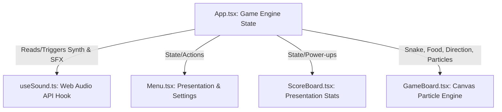

# Architecture & Algorithms - Snake Game (Vibe Edition)

This document provides a detailed breakdown of the software architecture, algorithms, and web technologies used to implement the **Snake Game (Vibe Edition)**.

---

## 🏗️ Software Architecture

The application is built using a modern **React + TypeScript** architecture with a unidirectional data flow. The components are structured into two categories: **Logical State Coordinator** and **Presentation Views**.



### Component Breakdown

| File / Component | Responsibility | State Managed |
| :--- | :--- | :--- |
| **[App.tsx](./src/App.tsx)** | Core Game Engine. Handles game loop timing, movement calculations, collision resolution, keyboard inputs, and state transitions. | `gameState`, `score`, `level`, `snake` coordinates, `direction`, `food` item, `powerUpActive`, `powerUpDuration`. |
| **[useSound.ts](./src/hooks/useSound.ts)** | Sound synthesizer. Manages Web Audio API node chains and runs the background synthwave step sequencer. | `soundEnabled` toggle, `musicEnabled` toggle, arpeggiator step tracker. |
| **[GameBoard.tsx](./src/components/GameBoard.tsx)** | Render pipeline. Performs canvas drawings (grid, food pulsations, snake body gradients, direction-facing eyes) and runs a custom particle physics loop. | `particles` (coordinate, velocity, decay, alpha arrays). |
| **[ScoreBoard.tsx](./src/components/ScoreBoard.tsx)** | Stats UI. Displays numerical data with glowing text effects and render bars for active power-ups. | None (Pure Presentational). |
| **[Menu.tsx](./src/components/Menu.tsx)** | Title screen UI. Displays game settings, instructions, and triggers session start commands. | None (Pure Presentational). |

---

## ⚙️ Algorithms & Mechanics

### 1. Game Loop & Dynamic Tick Rate
The game loop runs via standard `setInterval` inside `App.tsx`. Rather than a static speed, the tick rate (ms between frames) is computed dynamically on each render step based on difficulty, levels, and active power-ups.

$$\text{Tick Delay (ms)} = \text{Base Speed} \times \text{Power-up Modifier}$$

- **Base Speed**:
  - `EASY`: $160\text{ ms}$
  - `MEDIUM`: $110\text{ ms}$
  - `HARD`: $70\text{ ms}$
  - `VIBE`: Starts at $110\text{ ms}$ and decreases by $3\text{ ms}$ for every food item eaten ($\text{min } 40\text{ ms}$ threshold).
- **Power-up Modifiers**:
  - `SPEED` (Hyper Drive): Multiplies delay by $0.55$ (making the game run faster).
  - `SLOW` (Chill Vibe): Multiplies delay by $1.60$ (making the game run slower).

### 2. Snake Movement & Coordinate Math
Snake segments are represented as an array of coordinate nodes `Point[]` where index `0` represents the head. On each tick, a new head is computed by adding a direction vector to the current head's coordinates:

$$\vec{V}_{\text{UP}} = (0, -1), \quad \vec{V}_{\text{DOWN}} = (0, 1), \quad \vec{V}_{\text{LEFT}} = (-1, 0), \quad \vec{V}_{\text{RIGHT}} = (1, 0)$$

$$H_{new} = H_{current} + \vec{V}$$

The snake is updated as follows:
1. Prepend $H_{new}$ to the snake array (`[H_new, ...snake]`).
2. If $H_{new}$ overlaps the food coordinate, trigger the **Food Capture algorithm** and keep the tail segment.
3. If not, remove the last node (tail) of the array (`snake.pop()`).

### 3. Collision wrapping, Mode Settings & Shield Absorption
Standard classic snake terminates the session immediately upon wall crashes or self-intersections. This project introduces a customizable **Wall Collision Mode** toggle and a dynamic **Aegis Halo (Shield)** power-up:

#### Wall Collision Mode (Home Menu Toggle)
The player can slide between two configurations on the main menu:
- **`CRASH` Mode**: Violating boundary walls ($x < 0$, $x \ge W$, $y < 0$, or $y \ge H$) terminates the game immediately, unless protected by an active shield.
- **`PASS-THROUGH` Mode**: Boundary hits are safely bypassed. The snake head wraps around to the opposite side of the grid using modulo math:
  $$x_{\text{wrapped}} = (x + W) \pmod W$$
  $$y_{\text{wrapped}} = (y + H) \pmod H$$
  *Note: When Pass-Through mode is active, the snake wraps freely without consuming any active Aegis Halo shields.*

#### Aegis Halo (Shield) Power-up
The Aegis Halo power-up is an in-game item that spawns dynamically on the grid with a $4\%$ probability (food type: `'shield'`). Once eaten, it activates for $8$ seconds (80 ticks) and provides protection as follows:

*   **Boundary Shield Absorption (in CRASH mode)**:
    When hitting a boundary while wrap mode is disabled, the active shield absorbs the crash. It warps the head safely to the opposite border ($x_{\text{wrapped}}, y_{\text{wrapped}}$) and is consumed/deactivated.
*   **Tail Collision Absorption**:
    When the head coordinate steps on any of the snake's tail segments ($H_{\text{new}} \in S_{\text{body}}$), the active shield absorbs the crash. The snake is allowed to overlap/pass through the segment safely, and the shield is consumed/deactivated.

#### Ouroboros Easter Egg Achievement
If the snake reaches a length that occupies the **entire grid area** (i.e. $\text{finalLength} \ge W \times H$, which is exactly $400$ segments on the standard $20 \times 20$ grid) and suffers a self-collision (eating its own tail) without an active shield, the game overrides the standard Game Over screen flow to render a custom **Ouroboros Unlocked** achievement popup. This popup features:
- A custom CSS-animated spinning circular SVG snake biting its tail.
- A glowing neon gold (`var(--neon-gold)`) color palette.
- Descriptive copy detailing the completion of the cosmic cycle of death and rebirth.
- A call-to-action button ("Embrace the Cycle") that closes the popup to reveal the final statistics screen.

### 4. Non-Overlapping Food Spawning
To ensure food does not spawn directly on top of the snake's body, a candidate selection algorithm runs:

1. Pick a random grid position: $P = (\operatorname{rand}(0, W-1), \operatorname{rand}(0, H-1))$.
2. Check if $P \in S_{body}$.
3. If true, select a new random position.
4. Repeat up to a safety threshold ($100$ iterations) to prevent infinite loops in cases where the snake fills the board. If the threshold is hit, it defaults to the last safe coordinate.

---

## 🎵 Sound Synthesis Engine (Web Audio API)

To guarantee high performance and avoid external asset latency, all sounds are synthesized natively in `useSound.ts`.

### Waveforms & Audio Signal Chains

```
[Oscillator Node] ────► [Biquad Filter Node] ────► [Gain Node] ────► [Audio Output]
```

- **Oscillator Type**: Synthesizes wave shapes (`sine`, `triangle`, `sawtooth`, `square`).
- **Gain Envelope (Volume ADSR)**: Smooths audio start and end to avoid speaker pops, implementing a rapid exponential decay to silence.
  ```typescript
  gain.gain.setValueAtTime(volume, currentTime);
  gain.gain.exponentialRampToValueAtTime(0.001, currentTime + decayTime);
  ```

### Synthesized Sound Profiles

* **Coin Eat**: Square wave oscillation jumping from C5 ($523.25\text{ Hz}$) to E5 ($659.25\text{ Hz}$) over $0.25\text{ s}$ to create a bright chime.
* **Crash**: Combined white-noise buffer (constructed via a random float array) routed through a low-pass filter ramping from $400\text{ Hz}$ to $10\text{ Hz}$, paired with a low bass sawtooth wave down-glide from $120\text{ Hz}$ to $20\text{ Hz}$.
* **Power-up Start**: Sawtooth wave sliding exponentially from $220\text{ Hz}$ to $880\text{ Hz}$ routed through a peaking filter sweep.
* **Music Sequencer**: An automated scheduler triggering every $450\text{ ms}$. It rotates through a 16-step chord progression (C minor, G minor, Ab major, F minor), playing arpeggiated triangle notes alongside low sub-bass sine waves (e.g. root octave divided by 2).

---

## 🎨 Particle Physics Engine (HTML5 Canvas)

The `GameBoard.tsx` component features a lightweight canvas-based particle simulation to render neon explosions upon eating food.

### Physics Update Algorithm

Each particle is modeled with:
- Position Vector: $(x, y)$
- Velocity Vector: $(v_x, v_y)$
- Decay Rate: $d$ (reduction in alpha transparency)
- Color: Hex value matching the eaten food type

On each animation frame (coordinated via `requestAnimationFrame`):

1. **Calculate Positions**: Update coordinate position based on velocity:
   $$x_{t+1} = x_t + v_x, \quad y_{t+1} = y_t + v_y$$
2. **Apply Fade**: Reduce transparency:
   $$\alpha_{t+1} = \alpha_t - d$$
3. **Filter Particles**: Keep particles where $\alpha > 0$.
4. **Draw Canvas**: Render circular paths at $(x, y)$ with shadow blur properties matching their colors.

### Food Detect Eaten Ref Check
Rather than polluting React's global states with canvas animation states, the game board tracks the food location in a local React Ref:

```typescript
const prevFoodRef = useRef(food);
useEffect(() => {
  // If coordinates changed, food was captured!
  if (prevFoodRef.current.x !== food.x || prevFoodRef.current.y !== food.y) {
    createExplosion(prevFoodRef.current.x, prevFoodRef.current.y, prevFoodRef.current.type);
  }
  prevFoodRef.current = food;
}, [food]);
```

---

## ⚡ UI and Debounce Strategies

### Double Press Self-Collision Prevention
In standard canvas games, a fast double-keypress (e.g. pressing LEFT and then UP before the next game loop tick runs) can cause the snake to crash directly into its own body segment behind it. 

To prevent this:
1. We listen to keyboard input and save the desired direction into a separate buffer Ref: `nextDirectionRef`.
2. When evaluating directions, we enforce that `nextDirection` cannot be the direct opposite of the current active heading (e.g., if heading UP, we ignore DOWN key presses).
3. The actual state coordinate transition vector is updated inside the game tick interval loop and synchronizes `direction` state to match the buffer.
