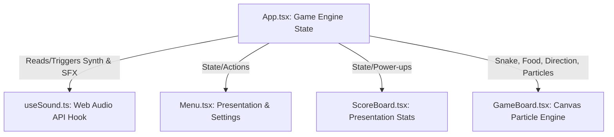

# Architecture & Algorithms - Snake Game (Vibe Edition)

This document provides a detailed breakdown of the software architecture, algorithms, and web technologies used to implement the **Snake Game (Vibe Edition)**.

---

## 📋 Game Requirements & Features

The **Snake Game (Vibe Edition)** is a premium, retro-neon styled web arcade game. The full scope of game requirements comprises the following features:

### 1. Game Modes & Difficulty Scale

- **Difficulty Multipliers**: Supports four difficulty levels that scale speed and score rewards:
  - **EASY**: 1.0x score multiplier.
  - **MEDIUM**: 1.5x score multiplier.
  - **HARD**: 2.0x score multiplier.
  - **VIBE**: 2.5x score multiplier (features incremental speed acceleration per food eaten).
- **Wall Wrap Settings**: Player can toggle between:
  - **CRASH**: Standard boundary game over state.
  - **PASS-THROUGH**: Snake head wraps to the opposite border (penalizes score by 5 PTS).

### 2. Dual-Food & Power-up Challenges

- **Dual-Food Challenge**: Eating normal food items increments a threshold counter. When matched, it spawns a standard food and a golden food concurrently. Capturing the golden food yields bonus points and clears the challenge.
- **Power-up Mechanics**:
  - **SPEED (Cyan Pulsation)**: Doubles speed, boosts points values.
  - **SLOW (Purple Pulsation)**: Slows ticks, facilitates easier navigation.
  - **SHIELD (Pink Pulsation)**: Grants 5 Aegis Halo charges, allowing the snake to wrap borders or safely clip through its own body.

### 3. Ultimate Achievements (Easter Eggs)

- **Victory Screen**: Occurs if the player fills all 400 grid coordinates without crashing, awarding them the crown title.
- **Ouroboros Screen**: Triggered if the snake occupies the entire grid and crashes into its own tail segment without an active shield. Features a custom spinning golden viper snake eating its own tail.

### 4. Interactive HUD, Controls & Score Sharing

- **Arcade Controls**: Offers spacebar pause/resume overlays and a bottom-aligned Pause/Resume and Quit toolbar.
- **High Score Achievements**: When a new record is hit, a golden container appears with options to share achievements (specifying score, level, and play duration) on **𝕏 (formerly Twitter)** and **WhatsApp**.

---

## 🧠 Core Engineering Concepts Used

To deliver a premium, latency-free, and mathematically smooth arcade experience, the following engineering paradigms were applied:

### 1. Functional React State Partitioning

- Separated game loops, event hooks, and viewport templates from entry wrappers.
- Extracted the synth engine into a custom React hook `useSound` to avoid component re-render interference.
- Standardized layout dimensions across panels (Menu, Instructions, Game Over, Ouroboros, Victory) using a global custom CSS property (`--panel-width: 440px;`).

### 2. Low-Latency Web Audio API Synthesis

- Implemented real-time hardware-level sound synthesis (no audio asset files are downloaded).
- Leveraged Oscillator nodes (sine, sawtooth, triangle, square waves) with ADSR exponential envelope gains to prevent speaker clicking.
- Built an automated sequencer polling every 450ms to drive the background synthwave bassline.

### 3. HTML5 Canvas & Particle Physics Engine

- Designed a custom canvas render pipeline.
- Implemented particle explosions: spawning vector points with velocity, direction, colors, and alpha decay to simulate physics collisions on food capture.
- Drawn glowing grid lines and glowing snake eyes oriented in the current heading direction.

### 4. Dynamic CSS Custom Properties (CSS variables)

- Created modular custom colors (`--neon-cyan`, `--neon-gold`, `--neon-pink`, etc.) representing theme tokens.
- Leveraged `getComputedStyle` in canvas contexts to read these dynamic styles in real-time, allowing the canvas theme to swap instantly when the user edits settings.

---

## 🏗️ Software Architecture

The application is built using a modern **React + TypeScript** architecture with a unidirectional data flow. The components are structured into two categories: **Logical State Coordinator** and **Presentation Views**.



### Component Breakdown

| File / Component                                      | Responsibility                                                                                                                                          | State Managed                                                                                                     |
| :---------------------------------------------------- | :------------------------------------------------------------------------------------------------------------------------------------------------------ | :---------------------------------------------------------------------------------------------------------------- |
| **[App.tsx](./src/App.tsx)**                          | Core Game Engine. Handles game loop timing, movement calculations, collision resolution, keyboard inputs, and state transitions.                        | `gameState`, `score`, `level`, `snake` coordinates, `direction`, `food` item, `powerUpActive`, `powerUpDuration`. |
| **[useSound.ts](./src/hooks/useSound.ts)**            | Sound synthesizer. Manages Web Audio API node chains and runs the background synthwave step sequencer.                                                  | `soundEnabled` toggle, `musicEnabled` toggle, arpeggiator step tracker.                                           |
| **[GameBoard.tsx](./src/components/GameBoard.tsx)**   | Render pipeline. Performs canvas drawings (grid, food pulsations, snake body gradients, direction-facing eyes) and runs a custom particle physics loop. | `particles` (coordinate, velocity, decay, alpha arrays).                                                          |
| **[ScoreBoard.tsx](./src/components/ScoreBoard.tsx)** | Stats UI. Displays numerical data with glowing text effects and render bars for active power-ups.                                                       | None (Pure Presentational).                                                                                       |
| **[Menu.tsx](./src/components/Menu.tsx)**             | Title screen UI. Displays game settings, instructions, and triggers session start commands.                                                             | None (Pure Presentational).                                                                                       |

---

## ⚙️ Algorithms & Mechanics

### 1. Game Loop & Dynamic Tick Rate

The game loop runs via standard `setInterval` inside `App.tsx`. Rather than a static speed, the tick rate (ms between frames) is computed dynamically on each render step based on difficulty, levels, and active power-ups.

$$\text{Tick Delay (ms)} = \text{Base Speed} \times \text{Power-up Modifier}$$

- **Base Speed**:
  - `EASY`: $160\text{ ms}$
  - `MEDIUM`: $110\text{ ms}$
  - `HARD`: $70\text{ ms}$
  - `VIBE`: Starts at $110\text{ ms}$ and decreases by $3\text{ ms}$ for every food item eaten ($\text{min } 40\text{ ms}$ threshold).
- **Power-up Modifiers**:
  - `SPEED` (Hyper Drive): Multiplies delay by $0.55$ (making the game run faster).
  - `SLOW` (Chill Vibe): Multiplies delay by $1.60$ (making the game run slower).

### 2. Snake Movement & Coordinate Math

Snake segments are represented as an array of coordinate nodes `Point[]` where index `0` represents the head. On each tick, a new head is computed by adding a direction vector to the current head's coordinates:

$$\vec{V}_{\text{UP}} = (0, -1), \quad \vec{V}_{\text{DOWN}} = (0, 1), \quad \vec{V}_{\text{LEFT}} = (-1, 0), \quad \vec{V}_{\text{RIGHT}} = (1, 0)$$

$$H_{new} = H_{current} + \vec{V}$$

The snake is updated as follows:

1. Prepend $H_{new}$ to the snake array (`[H_new, ...snake]`).
2. If $H_{new}$ overlaps the food coordinate, trigger the **Food Capture algorithm** and keep the tail segment.
3. If not, remove the last node (tail) of the array (`snake.pop()`).

### 3. Collision wrapping, Mode Settings & Shield Absorption

Standard classic snake terminates the session immediately upon wall crashes or self-intersections. This project introduces a customizable **Wall Collision Mode** toggle and a dynamic **Aegis Halo (Shield)** power-up:

#### Wall Collision Mode (Home Menu Toggle)

The player can slide between two configurations on the main menu:

- **`CRASH` Mode**: Violating boundary walls ($x < 0$, $x \ge W$, $y < 0$, or $y \ge H$) terminates the game immediately, unless protected by an active shield.
- **`PASS-THROUGH` Mode**: Boundary hits are safely bypassed. The snake head wraps around to the opposite side of the grid using modulo math:
  $$x_{\text{wrapped}} = (x + W) \pmod W$$
  $$y_{\text{wrapped}} = (y + H) \pmod H$$
  _Note: When Pass-Through mode is active, the snake wraps freely without consuming any active Aegis Halo shields._

#### Aegis Halo (Shield) Power-up

The Aegis Halo power-up is an in-game item that spawns dynamically on the grid with a $4\%$ probability (food type: `'shield'`). Once eaten, it activates for $8$ seconds (80 ticks) and provides protection as follows:

- **Boundary Shield Absorption (in CRASH mode)**:
  When hitting a boundary while wrap mode is disabled, the active shield absorbs the crash. It warps the head safely to the opposite border ($x_{\text{wrapped}}, y_{\text{wrapped}}$) and is consumed/deactivated.
- **Tail Collision Absorption**:
  When the head coordinate steps on any of the snake's tail segments ($H_{\text{new}} \in S_{\text{body}}$), the active shield absorbs the crash. The snake is allowed to overlap/pass through the segment safely, and the shield is consumed/deactivated.

#### Ouroboros Easter Egg Achievement

If the snake reaches a length that occupies the **entire grid area** (i.e. $\text{finalLength} \ge W \times H$, which is exactly $400$ segments on the standard $20 \times 20$ grid) and suffers a self-collision (eating its own tail) without an active shield, the game overrides the standard Game Over screen flow to render a custom **Ouroboros Unlocked** achievement popup. This popup features:

- A custom CSS-animated spinning circular SVG snake biting its tail.
- A glowing neon gold (`var(--neon-gold)`) color palette.
- Descriptive copy detailing the completion of the cosmic cycle of death and rebirth.
- A call-to-action button ("Embrace the Cycle") that closes the popup to reveal the final statistics screen.

### 4. Non-Overlapping Food Spawning

To ensure food does not spawn directly on top of the snake's body, a candidate selection algorithm runs:

1. Pick a random grid position: $P = (\operatorname{rand}(0, W-1), \operatorname{rand}(0, H-1))$.
2. Check if $P \in S_{body}$.
3. If true, select a new random position.
4. Repeat up to a safety threshold ($100$ iterations) to prevent infinite loops in cases where the snake fills the board. If the threshold is hit, it defaults to the last safe coordinate.

---

## 🎵 Sound Synthesis Engine (Web Audio API)

To guarantee high performance and avoid external asset latency, all sounds are synthesized natively in `useSound.ts`.

### Waveforms & Audio Signal Chains

```
[Oscillator Node] ────► [Biquad Filter Node] ────► [Gain Node] ────► [Audio Output]
```

- **Oscillator Type**: Synthesizes wave shapes (`sine`, `triangle`, `sawtooth`, `square`).
- **Gain Envelope (Volume ADSR)**: Smooths audio start and end to avoid speaker pops, implementing a rapid exponential decay to silence.
  ```typescript
  gain.gain.setValueAtTime(volume, currentTime);
  gain.gain.exponentialRampToValueAtTime(0.001, currentTime + decayTime);
  ```

### Synthesized Sound Profiles

- **Coin Eat**: Square wave oscillation jumping from C5 ($523.25\text{ Hz}$) to E5 ($659.25\text{ Hz}$) over $0.25\text{ s}$ to create a bright chime.
- **Crash**: Combined white-noise buffer (constructed via a random float array) routed through a low-pass filter ramping from $400\text{ Hz}$ to $10\text{ Hz}$, paired with a low bass sawtooth wave down-glide from $120\text{ Hz}$ to $20\text{ Hz}$.
- **Power-up Start**: Sawtooth wave sliding exponentially from $220\text{ Hz}$ to $880\text{ Hz}$ routed through a peaking filter sweep.
- **Music Sequencer**: An automated scheduler triggering every $450\text{ ms}$. It rotates through a 16-step chord progression (C minor, G minor, Ab major, F minor), playing arpeggiated triangle notes alongside low sub-bass sine waves (e.g. root octave divided by 2).

---

## 🎨 Particle Physics Engine (HTML5 Canvas)

The `GameBoard.tsx` component features a lightweight canvas-based particle simulation to render neon explosions upon eating food.

### Physics Update Algorithm

Each particle is modeled with:

- Position Vector: $(x, y)$
- Velocity Vector: $(v_x, v_y)$
- Decay Rate: $d$ (reduction in alpha transparency)
- Color: Hex value matching the eaten food type

On each animation frame (coordinated via `requestAnimationFrame`):

1. **Calculate Positions**: Update coordinate position based on velocity:
   $$x_{t+1} = x_t + v_x, \quad y_{t+1} = y_t + v_y$$
2. **Apply Fade**: Reduce transparency:
   $$\alpha_{t+1} = \alpha_t - d$$
3. **Filter Particles**: Keep particles where $\alpha > 0$.
4. **Draw Canvas**: Render circular paths at $(x, y)$ with shadow blur properties matching their colors.

### Food Detect Eaten Ref Check

Rather than polluting React's global states with canvas animation states, the game board tracks the food location in a local React Ref:

```typescript
const prevFoodRef = useRef(food);
useEffect(() => {
  // If coordinates changed, food was captured!
  if (prevFoodRef.current.x !== food.x || prevFoodRef.current.y !== food.y) {
    createExplosion(
      prevFoodRef.current.x,
      prevFoodRef.current.y,
      prevFoodRef.current.type,
    );
  }
  prevFoodRef.current = food;
}, [food]);
```

---

## ⚡ UI and Debounce Strategies

### Double Press Self-Collision Prevention

In standard canvas games, a fast double-keypress (e.g. pressing LEFT and then UP before the next game loop tick runs) can cause the snake to crash directly into its own body segment behind it.

To prevent this:

1. We listen to keyboard input and save the desired direction into a separate buffer Ref: `nextDirectionRef`.
2. When evaluating directions, we enforce that `nextDirection` cannot be the direct opposite of the current active heading (e.g., if heading UP, we ignore DOWN key presses).
3. The actual state coordinate transition vector is updated inside the game tick interval loop and synchronizes `direction` state to match the buffer.

---

## 📦 Important Libraries Used

The development dependencies and runtime libraries driving the game environment include:

### 1. Runtime Core

- **`react` & `react-dom` (v19)**: Facilitates single-page reactive view updates, modular component composition, state management hooks, and virtual DOM mapping.

### 2. Development & Bundling Tools

- **`vite` (v8)**: Modern ESM-based build tool that serves development modules with sub-millisecond Hot Module Replacement (HMR) and compiles production bundles.
- **`typescript` (v6)**: Adds static type verification, early syntax detection, and autocomplete compilation services.
- **`oxlint` (v1)**: High-performance, Rust-powered code linter that analyzes and enforces code style checks with zero-configuration overhead.

### 3. Testing Suite

- **`mocha` (v11)**: Test runner runner framework that sequences spec runs and generates assertion reports.
- **`chai` (v6)**: Behavior-Driven Development (BDD) assertion library used to test game coordinate logic and mathematical limits.
- **`jsdom` (v29)**: Pure-JavaScript browser environment simulation that mimics window, document, and canvas layouts to run browser-centric tests directly in Node.
- **`tsx` (v4)**: Type-execution tool that runs TypeScript files without pre-compilation steps.

### 4. Screenshot Capture Automation

- **`puppeteer-core` (v25)**: Automation framework driving Chrome via the DevTools protocol to sequence game states and write screen captures to `/screenshots`.

### 5. Sound & Audio Synthesis

- **Web Audio API (Native Browser Engine)**: Rather than adding bloated external audio libraries, sound effects and background arpeggiator music loops are synthesized natively in-browser. It makes use of standard W3C Web Audio components (such as `AudioContext`, `OscillatorNode`, `GainNode`, and `BiquadFilterNode`) to construct real-time synthesizers with zero HTTP asset load latencies.

---

## 📈 Time & Space Complexity Analysis

The runtime efficiency of the game engine is calculated relative to the snake length $N$ (where $N \le 400$ segments on a standard $20 \times 20$ grid) and total grid coordinates $G = W \times H$ (where $G = 400$):

### 1. Game State Update Loop (Runs per tick interval)

- **Time Complexity: $O(N)$**
  - **Head Movement & Wall Checks**: $O(1)$ coordinate addition and boundary validation.
  - **Self-Collision Check**: $O(N)$ linear search through the body segment array using `.some()` to verify no intersection with the head.
  - **Food Capture & Spawning**: $O(N)$ search to prevent food from spawning on top of the snake body. Expected number of retries is near $O(1)$ unless the grid is almost filled. The search is capped at a maximum of $100$ iterations to guarantee execution bounds.
  - **Overall Update Cost**: Dominated by self-collision checks ($O(N)$) and candidate food location checks ($O(N)$).
- **Space Complexity: $O(N)$**
  - Storing coordinates in the dynamic snake array `Point[]` requires $O(N)$ heap allocation space.
  - Score multipliers, difficulty switches, sound node targets, and timers occupy $O(1)$ stack space.

### 2. Graphics Rendering Engine (Runs per frame at 60 FPS)

- **Time Complexity: $O(G + N + P)$**
  - **Grid Rendering**: $O(G)$ iterations to draw coordinate grids and accent glowing tiles.
  - **Snake Segments Rendering**: $O(N)$ canvas drawing calls to paint glowing gradient nodes.
  - **Power-up Particle Simulation**: $O(P)$ calculations to update coordinates, velocity, decay rates, and alpha values for $P$ active particles (where $P \le 30$ particles, rendering this stage $O(1)$).
  - **Overall Render Cost**: $O(G + N)$ operations executed during each `requestAnimationFrame` render frame.
- **Space Complexity: $O(G + N + P)$**
  - The canvas context buffer allocates memory proportional to the resolution/viewport bounding rect ($O(G)$).
  - Particle state parameters are buffered inside a local component array of size $P$, requiring $O(P)$ memory.

### 3. Ouroboros Scaly Vector Generation

- **Time Complexity: $O(S)$**
  - Generating outer/inner circle boundaries to outline the tapering vector body string requires $S$ evaluations (where steps $S = 80$).
  - Appending $S$ overlapping scale boundary lines requires $S$ steps (where steps $S = 75$).
  - **Overall Calculation Cost**: Completed once during element initialization in $O(1)$ absolute CPU time.
- **Space Complexity: $O(S)$**
  - Storing path coordinate strings and scale React node collections requires memory size proportional to step counts ($O(S)$).
