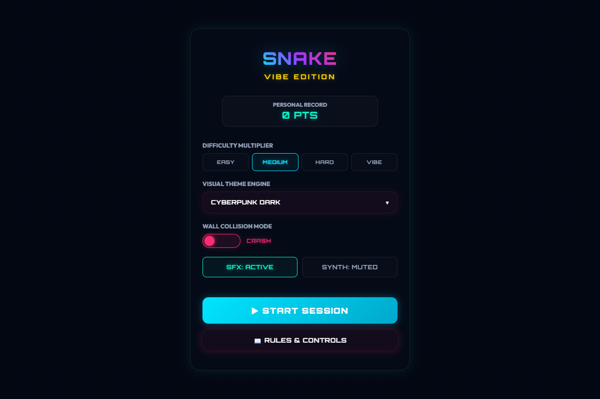
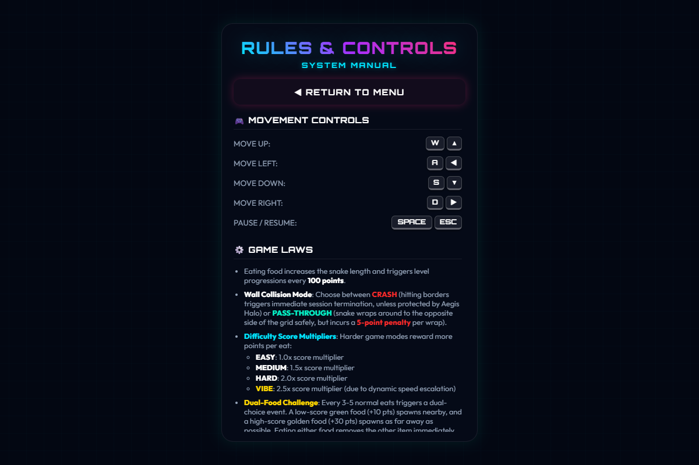
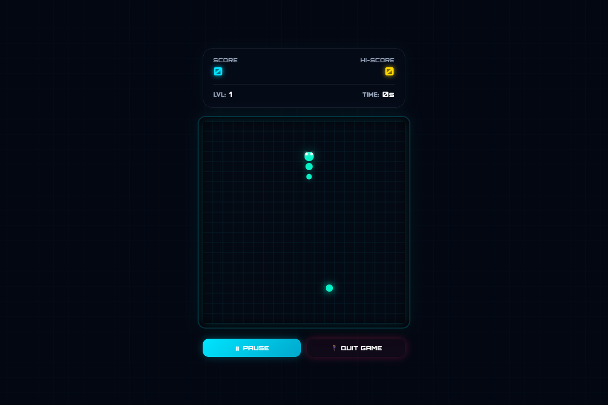
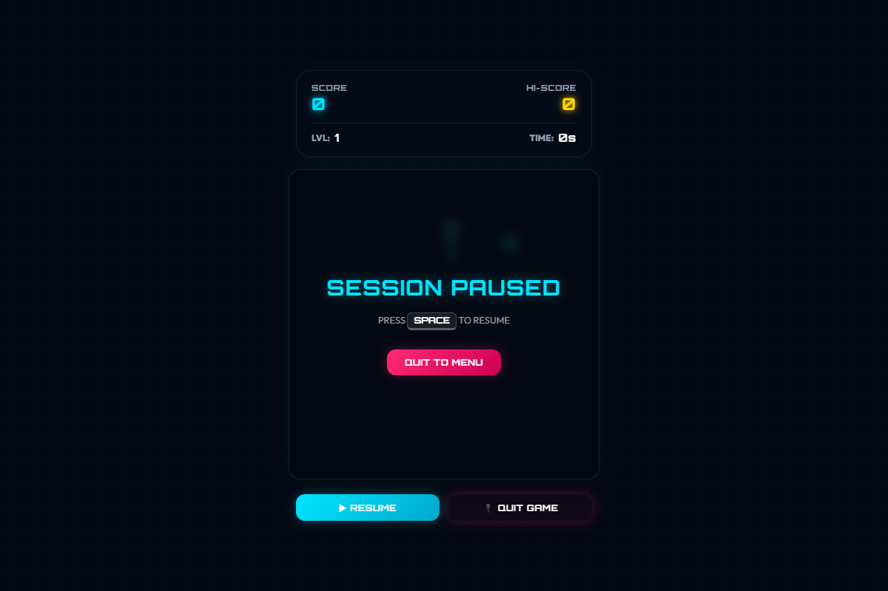
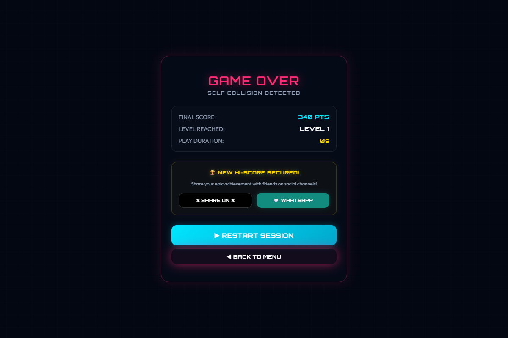
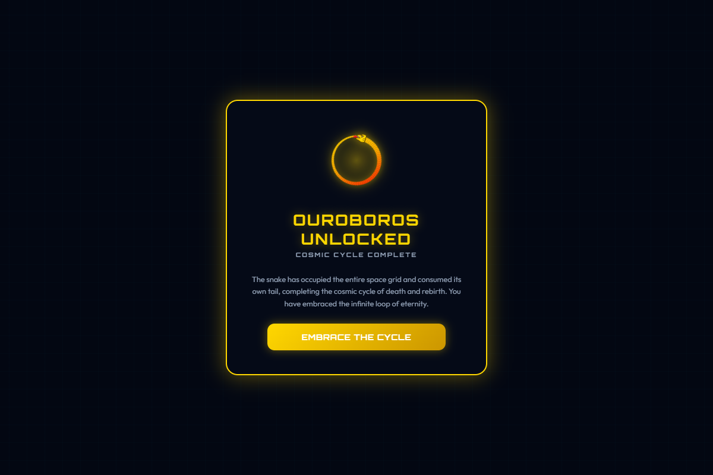
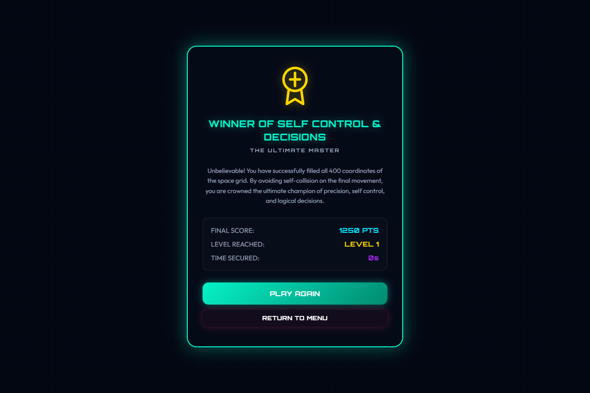

# Snake Game (Vibe Edition)

Welcome to **Snake Game (Vibe Edition)**, a premium, retro-futuristic arcade experience built on modern web technologies. This project reimagines the classic Nokia Snake game with rich neon aesthetics, HTML5 Canvas particle physics, dynamic speed modifications, custom shield collision wrapping, and real-time audio synthesis powered by the Web Audio API.

---

## 🚀 Quick Start

### Installation

```bash
npm install
```

### Dev Server

```bash
npm run dev
```

### Run Tests

```bash
npm test
```

---

## 🛡️ Aegis Halo & Power-ups

The game includes several power-ups that spawn dynamically:

| Power-up         | Color          | Score | Effect                                                              |
| :--------------- | :------------- | :---- | :------------------------------------------------------------------ |
| **Normal Food**  | Neon Green     | `+10` | Restores base speed.                                                |
| **Golden Chime** | Neon Gold      | `+30` | Spawns at maximum distance during the dual-choice challenge.        |
| **Hyper Drive**  | Neon Cyan      | `+10` | Overclocks game loop (1.8x speed) for 8s.                           |
| **Chill Vibe**   | Neon Purple    | `+10` | Slows game loop (0.62x speed) for 8s.                               |
| **Aegis Halo**   | Pulsating Pink | `+10` | Provides a 5-charge shield protecting against wall or tail crashes. |

### Shield Collision Wrap & Tail Absorption

If an active shield (`Aegis Halo`) is detected during border violations or self-intersection tests, the collision is absorbed, a charge is consumed, and when all 5 charges run out the shield is deactivated:

- Hitting a boundary in CRASH mode wraps you safely to the opposite border.
- Hitting a tail segment lets you pass through.

---

## 📸 Game Screen Captures

Here are the visual representations of each game state captured from the running application:

### 1. Main Title Menu


_The dynamic cyberpunk home screen showcasing difficulty sliders, sound toggles, wrap selectors, and personal record metrics._

### 2. Rules & System Manual


_The scrollable manual detailing keyboard key mappings, difficulty multipliers, and Aegis Halo mechanics._

### 3. Active Gameplay Loop


_The active canvas viewport showing the snake grid, pulsating food items, and direction-oriented glowing head eyes._

### 4. Game Session Paused


_The blurred background overlay showing a paused session, protected with a vibrant neon cyan halo._

### 5. Game Over Scoreboard


_The final statistics breakdown with new high score achievements and click-to-share integrations for WhatsApp and 𝕏._

### 6. Ouroboros Easter Egg


_The rare unlocked achievement screen showing a detailed vector snake eating its own tail in a golden cosmic cycle._

### 7. Ultimate Victory Achievement


_The winner screen displayed upon successfully navigating the snake to fill all 400 coordinates of the grid._
